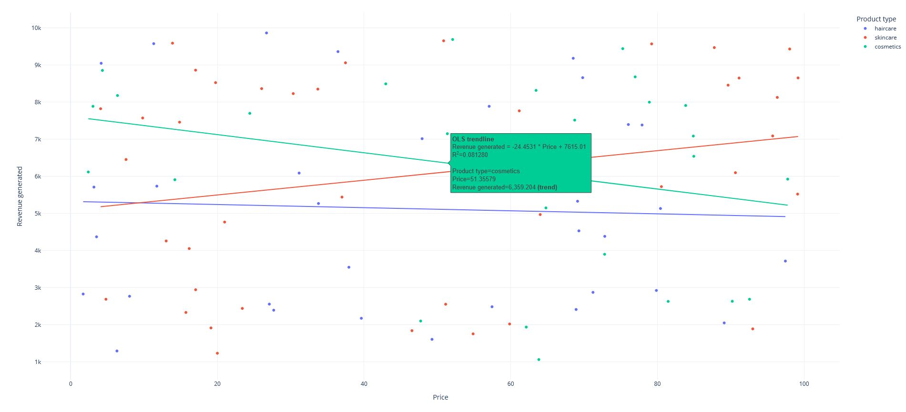

# Supply Chain Analysis Using Data Visualization

## Overview

This project focuses on analyzing a supply chain dataset using various data visualization techniques. The goal is to gain insights into different aspects of the supply chain, such as sales, revenue, shipping costs, defect rates, and more.

## Data Preparation

### Reading and Preprocessing Data:
- Load the supply chain data from a CSV file.
- Generate descriptive statistics for the dataset.

### Key Statistics:
- Print and review key statistics of the dataset.

## Exploratory Data Analysis (EDA) performed:

### Revenue Analysis by Product Type:
- To visualize the relationship between price and revenue generated.

### Sales Data by Product Type:
- To visualize the distribution of sales by product type.

### Total Revenue by Shipping Carrier:
- To visualize total revenue generated by each shipping carrier.

### Average Lead Time and Manufacturing Costs:
- Compute average lead time and manufacturing costs for each product type.

### Top 10 SKUs Analysis:
- To analyze the top 10 SKUs in terms of revenue, stock levels, and order quantities.

### Shipping Cost Analysis:
- To analyze shipping costs by carrier.

### Cost and Mode of Transportation Distribution:
- To visualize the distribution of shipping costs by transportation mode.

### Defect Rates by Product Type:
- To analyze average defect rates by product type.

### Defect Rates by Transportation Mode:
- To visualize defect rates by transportation mode.

### Revenue by Customer Demographics:
- To analyze revenue generated by different customer demographics.

### Analysis of 'Unknown' Demographics:
- To investigate the 'Unknown' customer demographic to understand the products they bought and their locations.

### Route Efficiency:
- To analyze route efficiency in terms of costs and defect rates.

### Correlation Matrix:
- To visualize the correlation matrix for numerical data.

### Geographic Analysis:
- To visualize revenue generated by different cities using a bubble map.

## Conclusion

This project successfully analyzes a supply chain dataset of a Fashion and Beauty company using various data visualization techniques, providing insights into different aspects of the supply chain.

## References:
- Supply Chain Data
- Project Reference
- Supply Chain Overview
